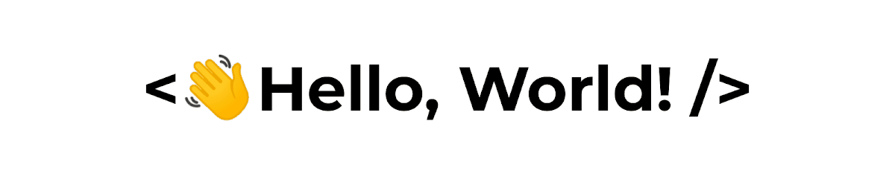
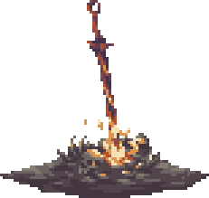

<h2 align="center">About Me</h2>


```kotlin
@Composable  
internal fun AboutMe() {
	val name = "Marcos Renann"
	val age = 21
	val studying = "Computer Science at UFCA"
	val work = "Android developer at Stone"
}
```

<h2 align="center">Language and Tools</h2>



<code></code>
<code></code>

#

<code></code>
<code></code>
<code></code>
<code></code>
<code></code>
<code></code>
<code></code>
<code></code>

<h2 align="center">Connect with Me</h2>

<div align="center">
<a href="https://github.com/mrenann" target="_blank">

</a>
<a href="https://linkedin.com/in/marcos-renann" target="_blank">

</a>
<a href="https://instagram.com/marcos_renann" target="_blank">

</a>  
<a href="mailto:marcos.renann.br@gmail.com" target="_blank">

</a>
</div>  

<h2 align="center">GitHub Stats</h2>

  

