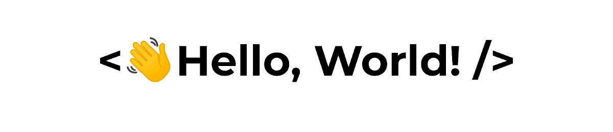

<h2 align="center">About Me</h2>


```kotlin
internal fun AboutMe() {
	val name = "Marcos Renann"
	val age = 24
	val studying = "KMP and Compose Multiplatform"
	val graduated2023 = "Computer Science at UFCA"
	val work = "Android / Mobile developer"
}
```

<h2 align="center">Language and Tools</h2>


<code></code>
<code></code>

#

<code></code>
<code></code>
<code></code>
<code></code>
<code></code>
<code></code>
<code></code>

<h2 align="center">Connect with Me</h2>

<p align="center">
<a href="mailto:marcos.renann.br@gmail.com"></a>
<a href="https://github.com/mrenann"></a>
<a href="https://linkedin.com/in/marcos-renann"></a>
<a href="https://instagram.com/marcos_renann"></a>
</p>

<h2 align="center">GitHub Stats</h2>

  

